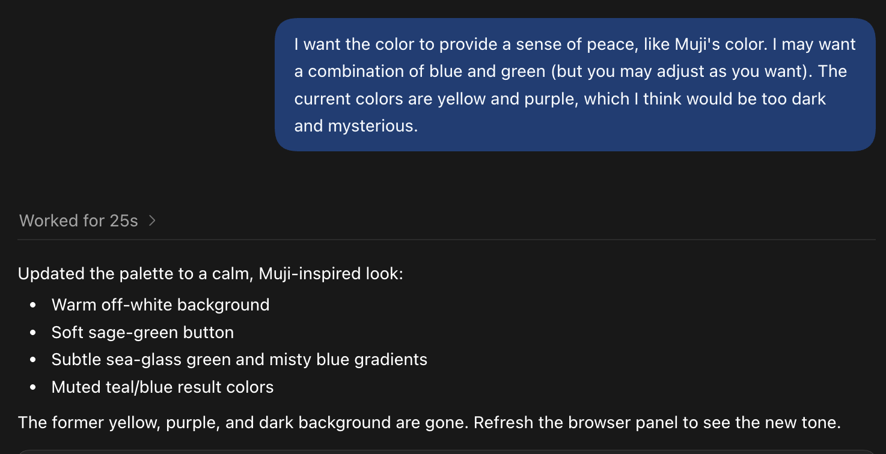
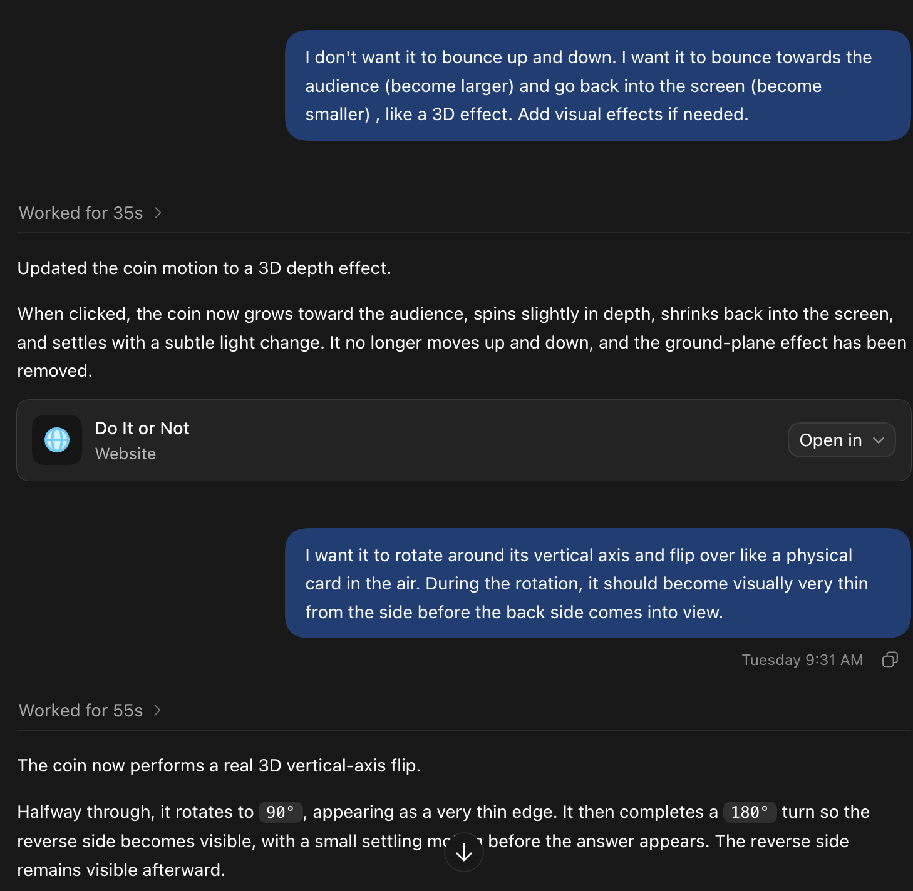
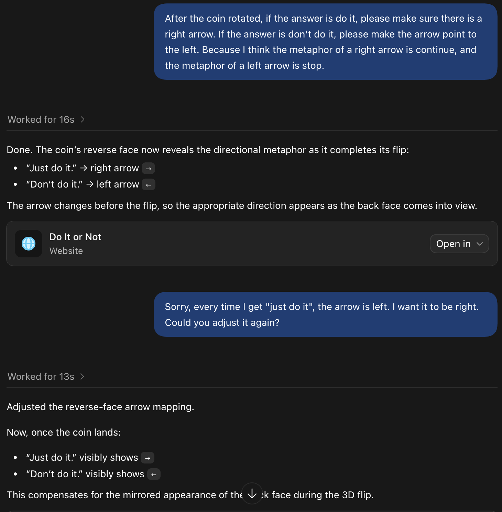
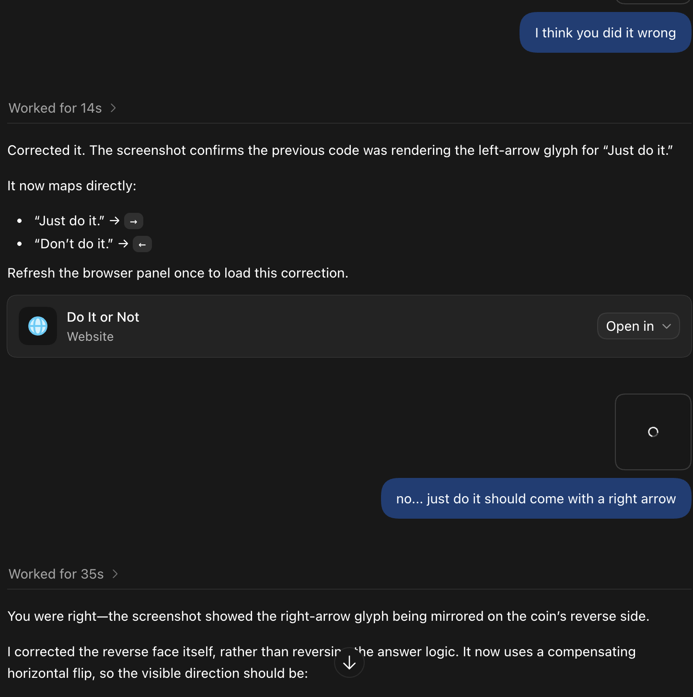
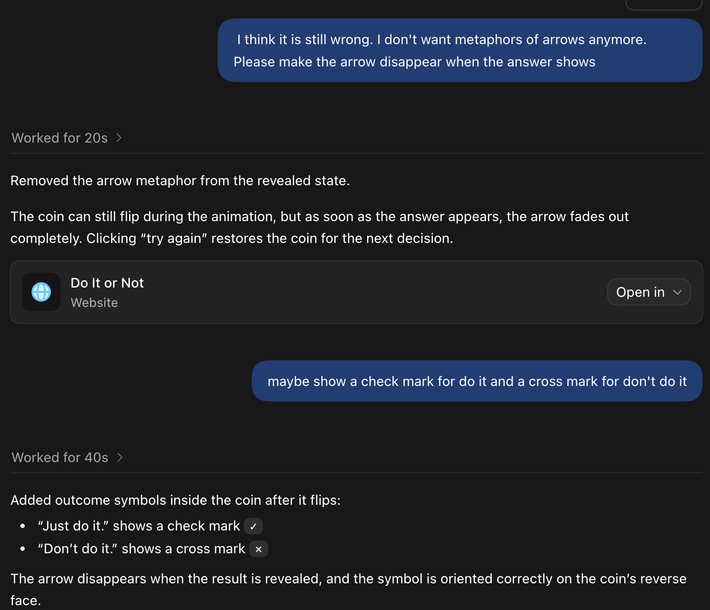

# Do It or Not

When someone chooses a color that matches their mood and tosses the decision coin, the experience should feel calm, playful, and supportive rather than stressful.

## Open it

No installation or build step is needed. Open [index.html](index.html) in any modern web browser. On macOS, you can also double-click the file in Finder.

## Design process

I tested several screen-color combinations to see whether the visual atmosphere matched my intention. The first version used black, purple, and yellow, which created a mysterious mood, but I wanted the experience to feel calmer and more reassuring for people who are uncertain about a decision. I therefore changed it to a lighter, more elegant palette. This showed me that Codex could respond well even to an abstract direction such as “make the atmosphere peaceful,” rather than only to specific color instructions.  I also changed the click effect: at first, I imagined a push-button interaction, but later I wanted it to feel more like tossing a coin. The final circular element became something between a button and a coin: it flips and then presents either “Do It” or “Don’t Do It.” Although this interaction communicates the intended result, its visual effect still does not fully achieve the satisfying coin-toss motion I originally imagined. 

AI helped me quickly test visual directions and interaction ideas, but I still needed to decide what user experience the program should create and what level of clarity mattered most. One unresolved problem was the result icon: I wanted a right arrow for “Do It,” suggesting forward movement, and a left arrow for “Don’t Do It,” suggesting stepping back. However, after the coin flipped, the arrows repeatedly appeared in the opposite direction, likely because the icon flipped together with the coin. Even after I tried to describe the problem more precisely, the result remained incorrect. I finally changed the system to use a check mark for “Do It” and a cross mark for “Don’t Do It.”  This process made me realize that my everyday language is not always precise enough for AI instructions. There is a significant difference between describing an idea naturally and giving clear, structured instructions that an AI can translate into an interaction.
